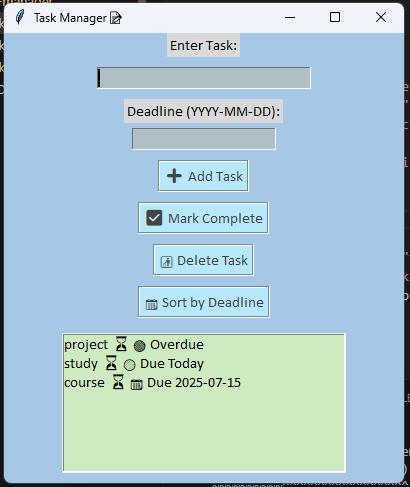

# Project
A simple Task Management 📝 app (CLI + GUI)

Features 🖇️ -
• ☑️ Add, view, complete, and delete tasks
• ⏰ Set deadlines and receive reminders
• 🖼️ GUI with pastel themed interface
• 📂 Tasks saved across sessions using JSON
• 📈 Sort tasks by deadline

Tech Stack 💻-
• Python core
• Tkinter for GUI
• JSON for data storage

How to Run 🚀 -
   
   CLI version-
      python task_manager.py
   GUI version-
      python gui_task_manager.py

Future improvements (optional)🌱 -
• User authentication for multiple profiles
• Multi-profile support

Preview 📌 -

